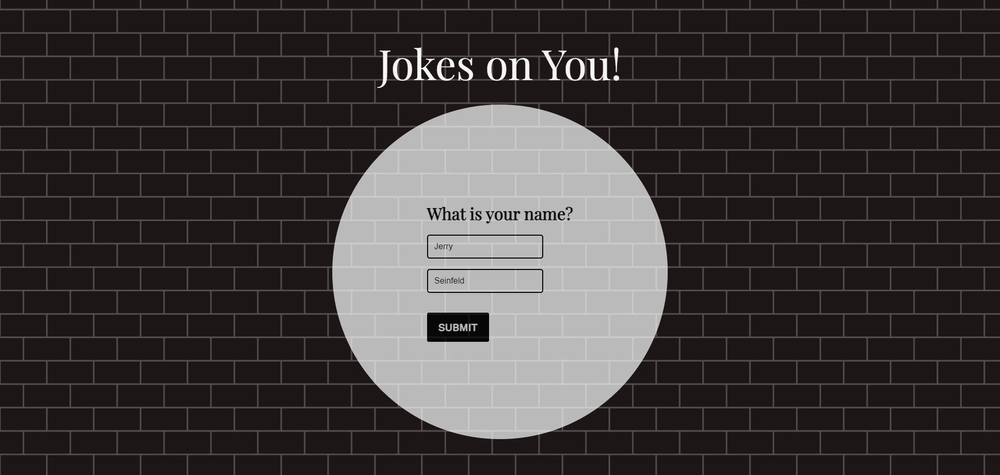

# Jokes On You! - A Public API Project
This is a capstone project for a Udemy course called The Complete Web Development Bootcamp 2023 (by The App Brewery).

## Project Instructions
In this project, students are expected to build a website using the Express/Node.js platform, with the Axios HTTP client, 
that integrates a chosen public API from the given list: Public API Lists. The website should interact with the chosen API, 
retrieve data, and present it in a user-friendly manner.

## Project Execution

### API Choice

JokeAPI is a REST API that serves uniformly and well formatted jokes.
It can be used without any API token, membership, registration or payment.
It supports a variety of filters that can be applied to get just the right jokes you need.
The usage is very simple and similar to other RESTful APIs and requires only basic knowledge of HTTP requests 
and JSON, XML, YAML or plain text. URL: https://v2.jokeapi.dev/

I chose this API to build a website that asks user for their name and presents a joke based on that input. 

### Features

#### Express Server Setup
* The index.js file contains the server setup using Express.js.
* Dependencies such as express, axios, and body-parser are utilized.

#### API Interaction
* The server communicates with the JokeAPI using the Axios HTTP client.
* The userNameAsNumber() function converts a user's name to a numerical value to determine the range of IDs for fetching jokes.
* Axios makes HTTP requests to the API endpoint, retrieving a set of 10 jokes based on the user's name.
* The retrieved jokes are then filtered with findSafeJoke() function to find a safe joke for display on the website.
  If the first joke of the array is not marked as safe for everyone, the function iterates through them until if finds a safe one.

#### Frontend Rendering
The index.ejs file is used for frontend rendering.
The HTML structure renders a form to collect the user's name and displays a joke if available.

## How to run locally
1. Clone this repository.
2. Navigate to the project directory.
3. Install dependencies using `npm install`.
4. Start the server using `npm start`.
5. Access the website in your browser at `http://localhost:3000`.

## Screenshots

## Screenshots

1. **Submit name**

2. **Get joke**

S